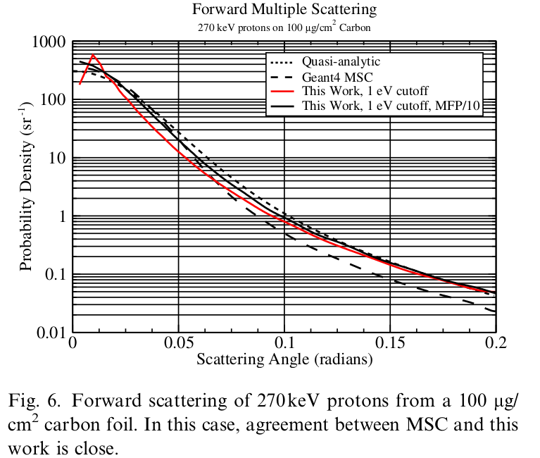
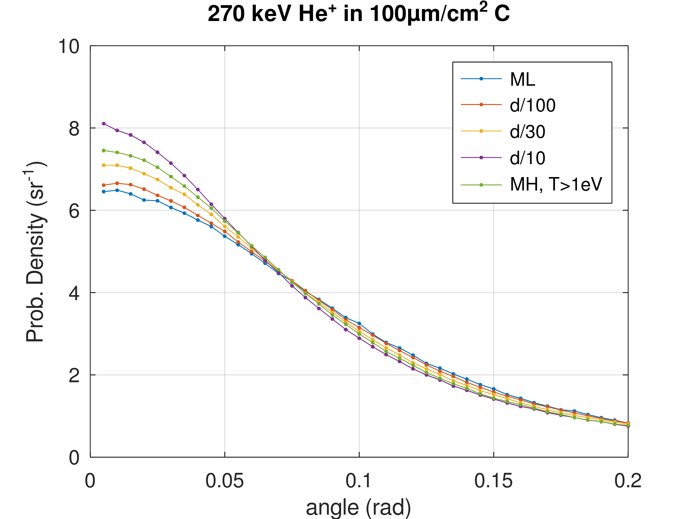
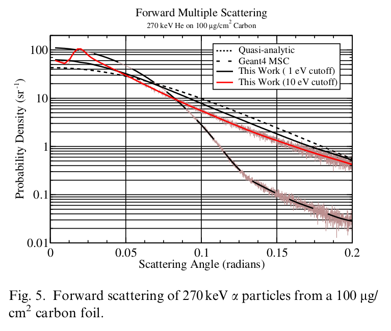

# Benchmarks

## Damage profiles

Compare to Crocombette2019, Lin2023 (Fe → Fe, Xe → UO2) \
H → Fe is for checking behaviour with light ions 

1. 2 MeV Fe in Fe target, t = 1200 nm
2. 500 keV Fe in Fe target, t = 600 nm
3. 3 MeV Xe in UO2 target, t = 1200 nm
4. 1 MeV Xe in UO2 target, t = 600 nm
5. 300 keV Xe in UO2 target, t = 300 nm
6. 3 MeV H in Fe target, t = 50 μm
7. 1 MeV H in Fe target, t = 10 μm

The above should be run for comparison in 
- SRIM QC & FC mode.
- #6 and #7 also in SRIM ML mode (see below)
- IRADINA

N ions = 20000

## Multiple scattering

Compare to the data of Mendenhall-Weller 2005 for 270 keV He and H ions on a 100μg/cm2 C foil.

We run the same test cases with MW2005 with the following settings:

1. mfp = ML (mfp = mean free path)
2. mfp = d/100 (d is the foil thickness)
3. mfp = d/30
4. mfp = d/10
5. Mendenhall-Weller algorithm, T>1 eV

The config files to run the cases are in folders 
- `test/msc/HinC/b1 to /b5` for the H on C
- `test/msc/HeinC/b1 to /b5` for the He on C

In each case there is a `run_all` script that runs all cases.

This is a  small angle multiple scattering calculation. In MW2005 they use a 1eV lower bound for the recoil energy and calculate the mfp accordingly. (for more details on flight path selection algorithms see [doc/FlightPath.md](../doc/FlightPath.md)) They report that the resulting mfp was very long and this was a problem for the calculation because there were very few scattering events.
They improved the results by biasing the algorithm to impose scattering in the foil.

In our case we use an upper bound for the mfp. Thus, we can adjust the number of events in the foil.
As seen in the figures, at 100 scattering events/ion (MFP = d/100) the curve is very close to the "monolayer" (ML) mode, where we have approx. 3500 events/ion. With MFP=d/100 the calculation is reduced by ~30 times wrt to ML.

Compared to MW2005, our calculation is "analog", i.e., no biasing/variance reduction is used. 

However, our results are much different from MW2005. Why ???

## SRIM monolayer mode

*This is another not well documented SRIM feature !!!!*

If you select FC mode with a light ion, e.g. 1 MeV H in Fe, SRIM gives you this warning:

> Energetic Light Ions with Full Cascades?
> 
> You have specified    a calculation for an energetic light ion into a target with full damage cascades. Although the average TRIM calculation results will be correct, there may be anomalous peaks and dips in the damage distributions. TRIM uses the concept of a Free Flight Path for the ion. That is, the ion does not have a full interaction at every monolayer of the target but instead it skips over many atoms between each detailed collision. The damage is then statistically distributed back over this path. The Free Flight Path can be quite large, almost 1um for a 10 MeV proton in a light target (carbon). This means that the kinetics of the ion/target interactions is calculated for one point, and then a jump of 1 um is made before the next detailed calculation. The damage which occurs during the jump is calculated and distributed over the 1 um Flight Path.    So the energy loss by the ion to the target is evenly distributed and no anomalies should occur.
> 
> However, damage cascades are only inintiated at the end of each flight path, and if a cascade of target atoms is initiated, it can only start in one place (it can't be distributed statistically). Hence there may appear anomalous peaks in the total recoil atom damage about one Free Flight Path from the surface or an interface. Similarly, there may be anomalous dips in the calculated damage near the surface since all ions start with a large initial Free Flight Path and may not indicate any recoil cascades near the surface.
It is suggested that you try TRIM to see if any of these anomalous peaks and dips occur for your calculation of target recoil damage. If you see a problem, then it can be easily corrected by eliminated the Free Flight Path from the calculation. This is done in the TRIM Setup Window, in the upper right menu called DAMAGE. Select the third item in the drop-down menu: "Surface Sputtering / Monolayer Collision Steps". This will eliminate all Free Flight Paths, and all the collision cascades will be correctly calculated. 
> 
> Note that this "fix" will slow TRIM down by a large factor, 10-50x. But it is necessary for accurate results.

However, there are the following problems:

1. **VACANCY.txt**: In monolayer mode the file has 2 columns (V by ions, V by recoils) just as in QC. Note that FC has different columns: e.g. for H in Fe (V by H - the ion, Fe vacancies)
2. In the VACANCY.txt of monolayer mode there is another warning (!!!):
> NOTE: Vacancies not accurately calculated in SPUTTERING calculation.   
> Atoms move if Energy > E(surface) instead of Energy > E(displacement)  
> Quick Fix for near-surface vacancies: Make E(surface)= E(displacement),
> and use Monolayer Steps (TRIM Damage Setup). Not perfect, but OK.  

Thus we must additionally put Es = Ed

We should test it in the future