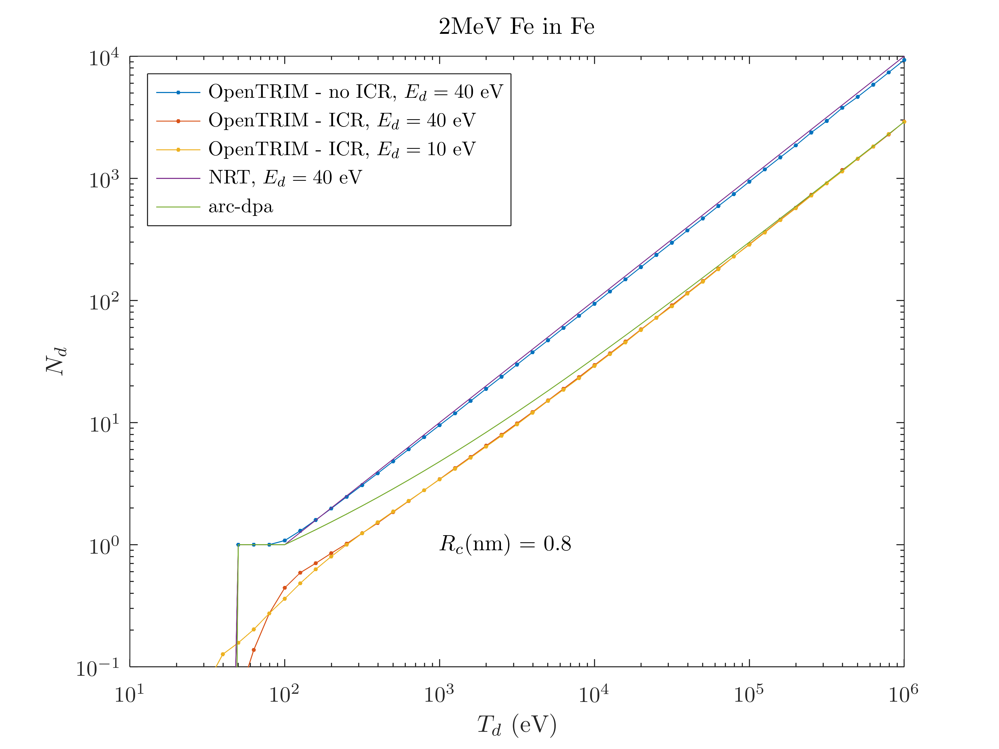
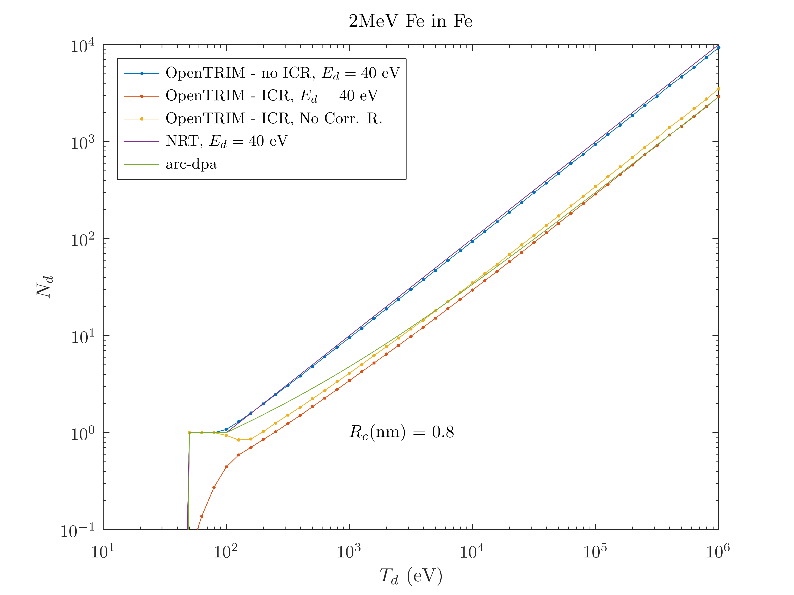
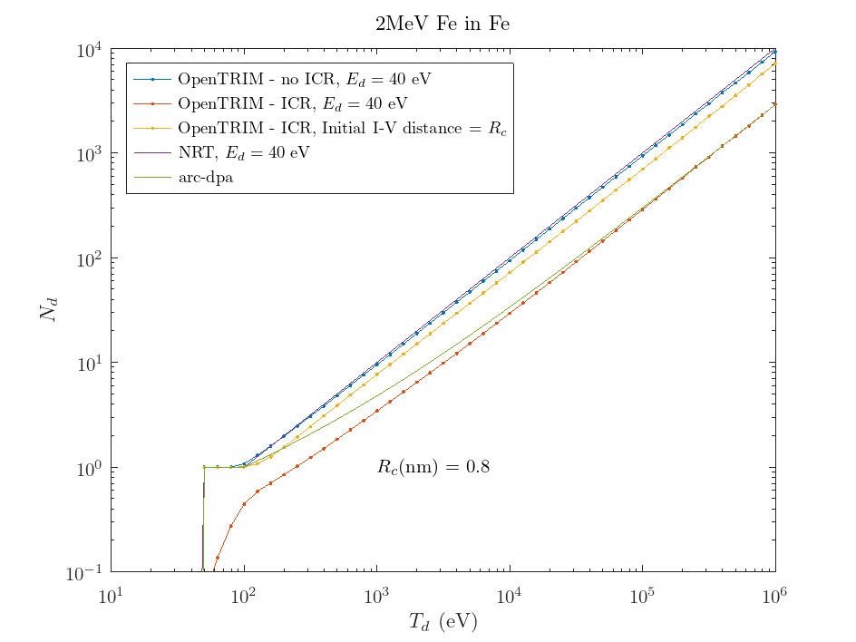

# OpenTRIM + Intra-cascade recombination (ICR)

4/2/2025

## Implementation

- A Frenkel pair is unstable and thus recombines if the I-V distance is below $R_c$
- The I-V capture radius $R_c$ is introduced as a parameter/property of each atomic species in a target material
- In the ion transport simulation, ICR is implemented as follows: 
  - All I & V generated in a PKA cascade are stored in a time ordered list 
  - After the cascade finishes, the list is traversed from the start and each defect may recombine with preceding anti-defects within its capture radius.

The files `icr1.m` to `icr3.m` run `opentrim` and analyze the output to create the figures below.

## Test case: 2 MeV Fe on Fe

- For Fe a typical value for $R_c$ is 0.80 nm = $2.8 a_0$. It has been reported that with this value similar defect production is obtained for MD and BCA

In the following, electronic energy loss is switched off in order to observe only the effects of nuclear scattering.

From the above figure it is seen that
- Without ICR there is good agreement with the NRT model for $E_d=40$ eV
- With ICR:
  - Above 10keV the number of generated defects falls to $\sim 30\%$ of the NRT, in agreement with arc-dpa / MD
  - At low $T_d\lesssim 200$ eV, $N_d < 1$, i.e., most of the defects generated  at low $T_d$ recombine. This contradicts the basic assumption of damage models that recoils with $E_d<T_d<2 E_d/0.8$ result in the production of one stable FP 
  - The value of $E_d$ does not play a significant role

## Disabling of correlated recombination

To address the behavior of $N_d$ at low damage energy we tried disabling the recombination of I-V from the same FP, i.e., of correlated defects.

This results in the following behavior

For $T_d\lesssim 100$ eV the number of defects is indeed 1. 

However, for slightly higher energies, $N_d$ goes initially below 1 and then starts to grow again. This is unphysical.

The number of defects at $T_d>1$ keV is slightly higher. This is due to the non-recombination of correlated I-Vs. They correspond to about 10% of the total number of recombinations at high $T_d$.

## Generating FPs with initial separation between I-V

Another idea was to generate FPs with an initial separation between V and I equal to $R_c$.

Thus, in a collision with recoil energy $T>E_d$ the recoiling ion is positioned initially at a distance $R_c$ from the point of impact, where the vacancy is created. The initial kinetic energy of the recoiling atom is $T - E_{FP} - R_c\,S_e(T)$, where $E_{FP}$ is the FP formation energy (or lattice binding energy) and $S_e$ the electronic stopping power. 

This results in the following damage curve

It is seen that with this assumption the low energy part of the curve ($T_d\lesssim 200$ eV) is in agreement with the arc-dpa model. 

However, at high $T_d$ there is much less recombination. The remaining stable defects are roughly at 80% of NRT. This is difficult to reconcile with the result of the previous paragraph, which showed that correlated recombinations represent only 10% of the total recombinations happening in a high energy cascade. One would anticipate that creating I-V pairs at initial distance equal to $R_c$ would primarily affect only those correlated recombinations. However, the above figure proves that this is not correct. The matter needs more study.
